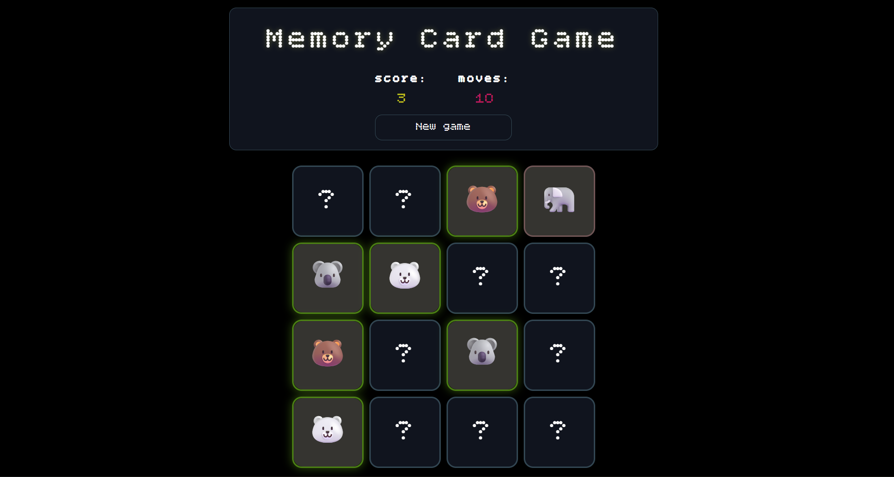

# React Memory Cart Game 🐋

Классическая игра «Найди пару», написанная на React.
Игровое поле состоит из рубашек карт. Кликая по ним, игрок открывает по две карты за ход. 
Если изображения совпадают - карты исчезают, если нет - снова переворачиваются рубашкой вверх. 
Все ходы и найденные пары подсчитываются.





---

## 🚀 Технологии

- React 18
- Vite
- TS
- Scss

---

## ⚙️ Установка и запуск

1. Клонируйте репозиторий и перейдите в папку Memory-card-game:
   ```bash
   git clone https://github.com/IvanT00/Memory-card-game.git 
   cd Memory-card-game
2. Установите зависимости:
   ```bash
   npm install
3. Запустите приложение в режиме разработки:
   ```bash
   npm run dev